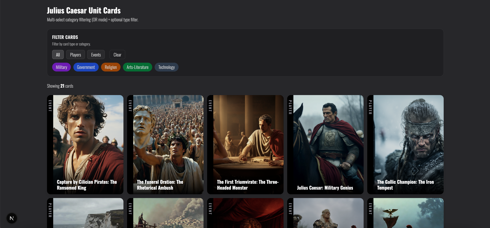
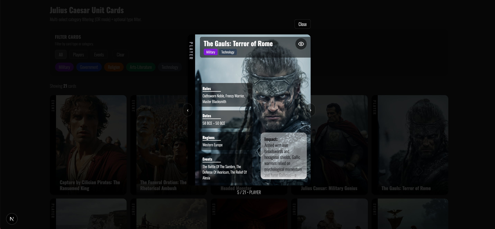
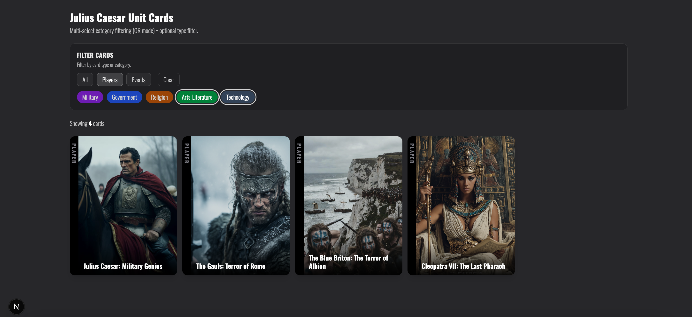

# Interactive Card Filtering UI

A reusable card interface built with **Next.js (App Router)**, **TypeScript**, and **Tailwind CSS** demonstrating advanced UI component architecture, multi-select filtering, and modal navigation.

This project focuses on building a scalable card system with clean separation between **UI components** and **domain logic**, intended as a foundation for a larger educational platform.

---

## Live Demo

Live App: https://card-filter-fawn.vercel.app/
GitHub Repo: https://github.com/wesnimmo/card-filter

---

## Screenshots

### Card Grid


### Modal View


### Filtering UI


---

## Key Features

- **Multi-Select Category Filtering**  
  Filter cards by multiple categories simultaneously.

- **Type Filtering**  
  Toggle between *All*, *Players*, and *Events*.

- **Modal Card Viewer**  
  Clicking a card opens a detailed modal view.

- **Keyboard Navigation**
  - `←` Previous card
  - `→` Next card
  - `Esc` Close modal

- **Backdrop Close**
  Clicking outside the card closes the modal.

- **Overlay Toggle**
  Hide or reveal card data to focus on the image.

- **Responsive Card Grid**
  Optimized layout displaying multiple cards per row.

---

## Tech Stack

| Tool | Purpose |
|-----|-----|
| **Next.js (App Router)** | React framework and routing |
| **TypeScript** | Strongly typed data models |
| **Tailwind CSS** | Responsive UI styling |
| **React Hooks** | State management and memoized filtering |

---

## Architecture Highlights
## Core Logic Example

Filtering is implemented as a reusable pure function that separates business logic from UI rendering.

```ts
export function filterCards(args: {
  cards: Card[];
  selectedCategories: Category[];
  matchMode: MatchMode;
  typeFilter: TypeFilter;
}): Card[] {
  const { cards, selectedCategories, matchMode, typeFilter } = args;

  return cards.filter((card) => {
    if (typeFilter !== "all" && card.type !== typeFilter) return false;

    if (selectedCategories.length === 0) return true;

    return matchMode === "all"
      ? selectedCategories.every((cat) => card.categories.includes(cat))
      : selectedCategories.some((cat) => card.categories.includes(cat));
  });
}

### Separation of UI and Logic

Domain logic is isolated from UI components to keep business rules reusable and independent of rendering.

**Domain Layer**


src/lib/cards/
cards.types.ts
cards.filter.ts
cards.constants.ts
cards.mock.ts


**UI Components**


src/components/cards/
CardTile.tsx
CardDetail.tsx
CardGrid.tsx
CardModal.tsx


This separation keeps filtering logic testable and prevents UI components from becoming overly complex.

---

## Design Decisions

### CardTile vs CardDetail

The card UI is intentionally split into two components:

- **CardTile** → lightweight grid card
- **CardDetail** → detailed modal card

This separation prevents grid rendering from becoming unnecessarily complex.

---

### Modal Interaction Design

The modal supports multiple interaction patterns:

- Close button
- Escape key
- Backdrop click
- Arrow navigation

This mirrors behavior found in production web applications.

---

## Future Improvements

- Add keyboard focus trapping for accessibility
- Animate modal entry/exit
- Add unit tests for filtering logic
- Connect cards to a backend or CMS
- Implement pagination or infinite scroll

---

## Author

Wes Nimmo  
Frontend Developer